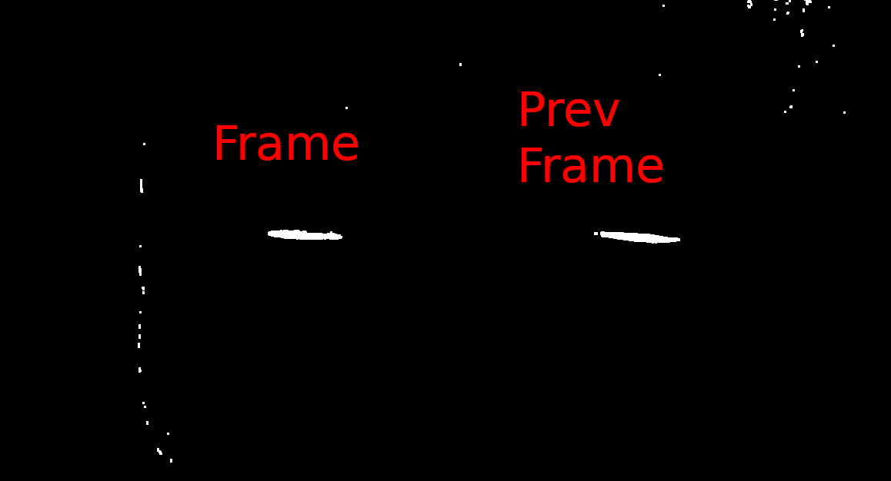
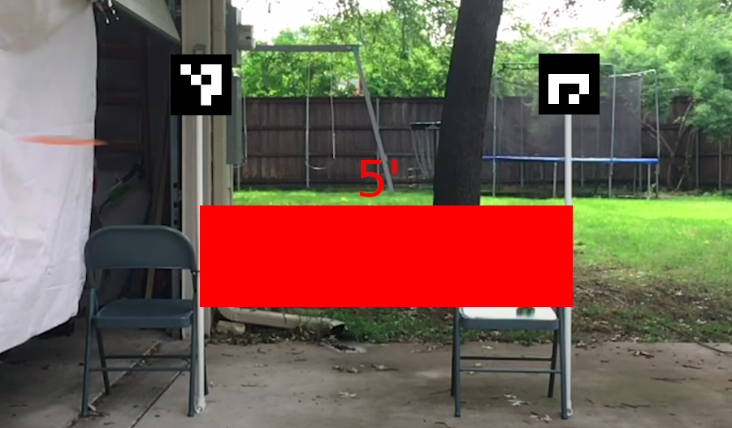
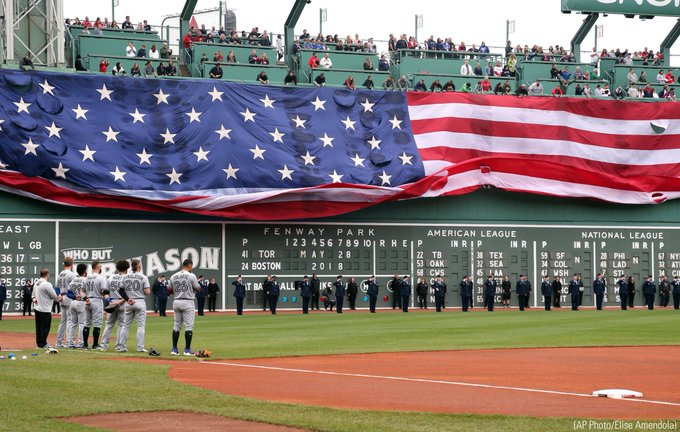

# Disc Speed
This program will record your disc speed in a text file and display it back to you in real time.

The program uses a diff between two frames to find the location of the disc and calculates the speed by referencing the two aruco tags.

## Setup
### Camera
The setup uses opencv VideoCapture and can be provided a webcam id, video file, or use a tool like DroidCam.

DroidCam String `'http://[[Your Phone IP]]:4747/mjpegfeed?640x480'`
### Setting up the tape measure (Aruco Tags)
The program expects two aruco tags (seen below). By default the distance between the tags is expected to be 5 feet (center to center). For best results, the tags should be at throwing height and be horizontally even.

### The environment
It's important that the background is static, so that the diffing algorithm doesn't pick up other movement. A wall is the ideal back drop. Shadows have a chance to be picked up depending on the light condition. Don't try to measure your throws with a flag in backgound in stadium.

from pytablewriter import MarkdownTableWriter
# Disc Gap (inches) Per Frame (FPS vs Speed)

|Speed (MPH)|15 FPS |30 FPS |60 FPS |120 FPS|240 FPS|
|----------:|--:|--:|--:|--:|--:|
|          5| -3| -5| -7| -8| -8|
|         10|  3| -3| -5| -7| -8|
|         15|  9|  0| -4| -6| -7|
|         20| 15|  3| -3| -5| -7|
|         25| 21|  6| -1| -5| -7|
|         30| 27|  9|  0| -4| -6|
|         35| 33| 12|  2| -3| -6|
|         40| 39| 15|  3| -3| -5|
|         45| 45| 18|  5| -2| -5|
|         50| 51| 21|  6| -1| -5|
|         55| 57| 24|  8|  0| -4|
|         60| 62| 27|  9|  0| -4|
|         65| 68| 30| 11|  1| -4|
|         70| 74| 33| 12|  2| -3|
|         75| 80| 36| 14|  3| -3|
